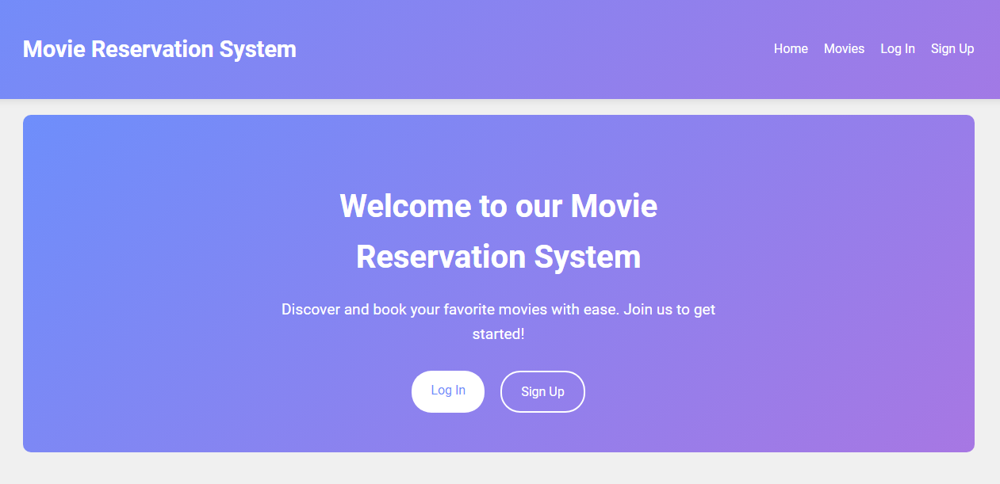
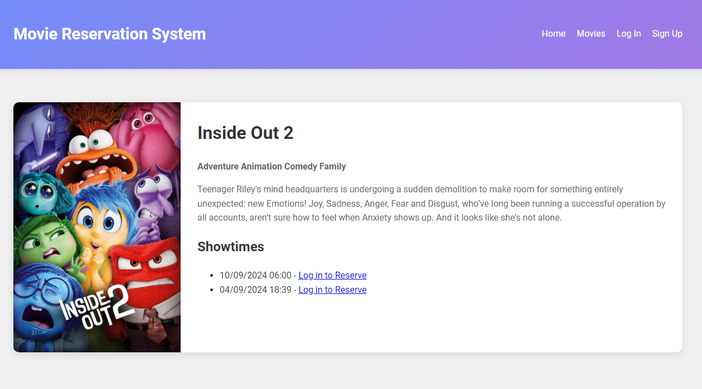
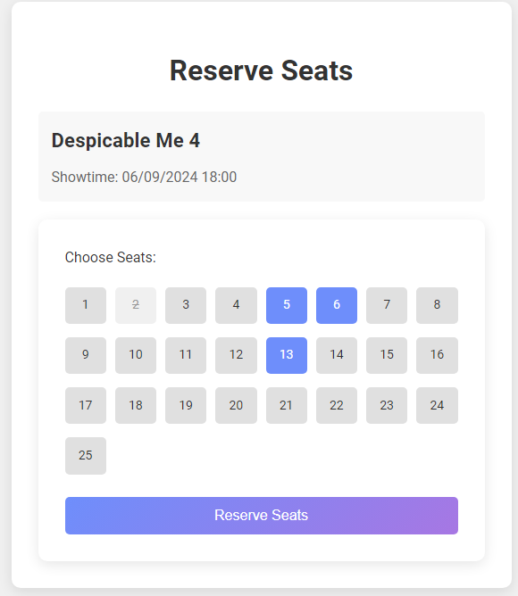
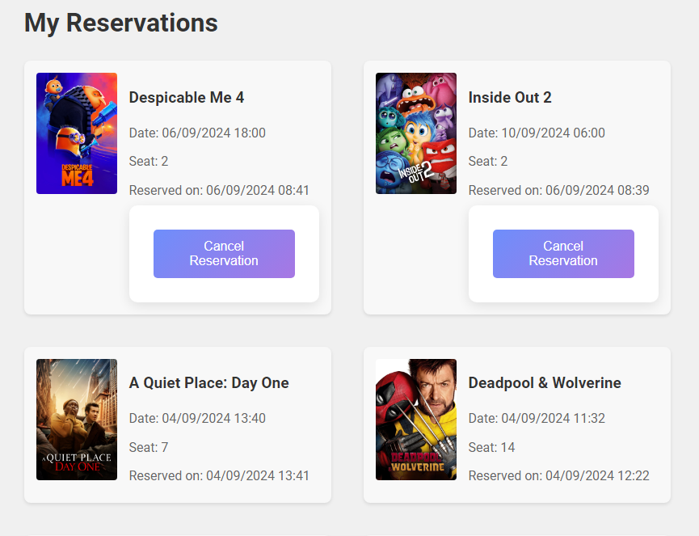

# Django solution for the Movie Reservation System project in roadmap.sh

This project is a Django implementation of the Movie Reservation System challenge from roadmap.sh.

**Challenge URL:** [https://roadmap.sh/projects/movie-reservation-system](https://roadmap.sh/projects/movie-reservation-system)

## Description
This application allows users to view movies currently showing, make seat reservations for specific showtimes, and manage their reservations. The system also includes an administration interface for managing movies, showtimes, and reservations.

## Key Features

1. **Movie listings**: Users can view movies currently showing, including details such as title, description, and genre.

2. **Seat reservation**: Users can select a showtime and reserve available seats.

3. **Reservation management**: Users can view and cancel their upcoming reservations.

4. **User authentication**: Registration and login system to manage user reservations.

5. **Admin aanel**: Administrative interface for managing movies, showtimes, seats, and reservations.

## Requirements

- Python 3.8+

## Setup and Installation

1. Clone the repository:
   ```
   git clone https://github.com/AghastyGD/movie-reservation-system-django.git
   cd movie-reservation-system-django
   ```

2. Create and activate a virtual environment:
   ```
   python -m venv venv
   source venv/bin/activate  # On Windows use `venv\Scripts\activate`
   ```

3. Install dependencies:
   ```
   pip install -r requirements.txt
   ```

4. Set up environment variables:
   Copy the .env.example file to .env:
   ```
   cp .env.example .env
   ```
   Then edit the .env file and add your TMDB API key:
   ```
   TMDB_API_KEY=your_secret_key_from_The_Movie_Database
   ```
   Note: The TMDB API key is necessary to fetch movies automatically into the system.

5. Run migrations:
   ```
   python manage.py migrate
   ```

6. Create a superuser:
   ```
   python manage.py createsuperuser
   ```

7. Import movies from TMDB:
   ```
   python manage.py import_movies
   ```
   This command will fetch movies from The Movie Database and populate your local database.

8. Start the development server:
   ```
   python manage.py runserver
   ```

9. Access the site at `http://localhost:8000` and the admin at `http://localhost:8000/admin` 

## Usage

1. **As a User**:
   - Register or log in
   - Browse available movies
   - Select a showtime and choose your seats
   - View and manage your reservations

2. **As an Administrator**:
   - Access the admin panel (currently using the default django admin panel)
   - Manage movies, showtimes, seats, and reservations
   - View reservation statistics
   - Manage users:
     - Create, edit, and delete user accounts
     - Assign staff status to users, granting them access to the admin panel
     - Manage user permissions, controlling access to specific parts of the admin interface
     - Create and assign user groups for easier permission management
   - Monitor system activity and user interactions

## Screenshots

Here are some screenshots of the app in action:

### Home Page


### Movie Details


### Seat Selection


### User Reservations



### Project Key Components:

- **reservations/**: The main app handling movie listings, showtimes, and reservations.
  - `management/commands/import_movies.py`: Custom management command to import movies from TMDB (Currently fetching just top 20 popular movies to avoid database overload).
  - `models.py`: Defines the data models for Movie, Showtime, Seat, and Reservation.
  - `views.py`: Contains the logic for displaying movies, handling reservations, etc.

- **users/**: Custom app for user authentication and management.
  - Handles user registration, login, and profile management.

- **templates/**: Contains HTML templates for rendering pages.
  - Includes base templates and app-specific templates.

- **static/**: Stores static files.
- **.env**: Stores environment variables like the TMDB API key (not included in version control).

### Contribuitions
Contributions are welcome! Feel free to contribute with any sugestions, issues and so on :)